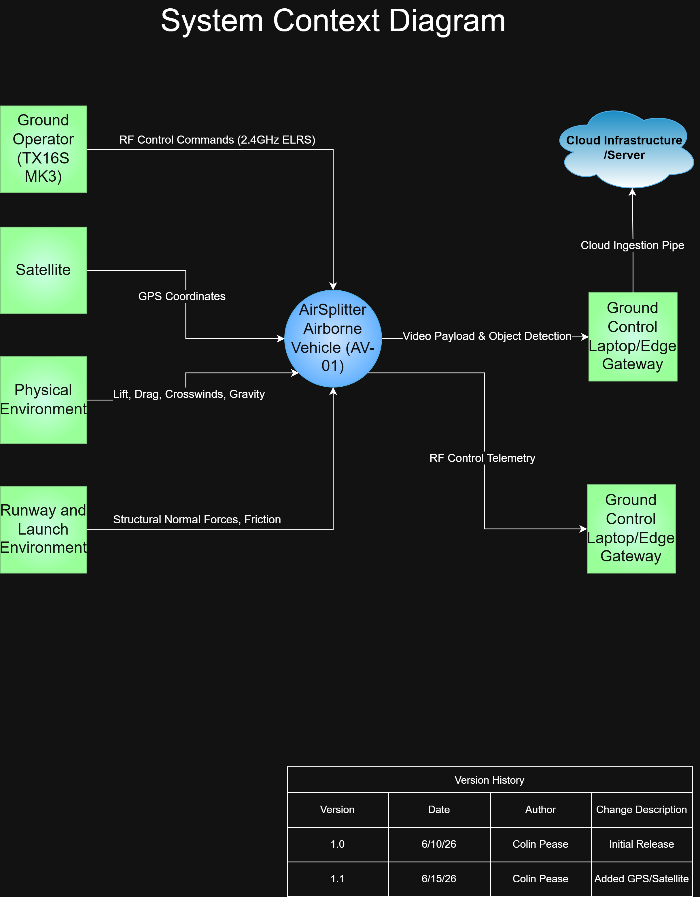

# AirSplitter: Fixed-Wing Autonomous Systems Engineering Portfolio

# Team Roles
*   **Lead Systems Engineer:** Orchestrating tasks, routing tasks to small integrated product team (IPT)
*   **Avionics Engineer:** FC, ESC, power, wiring harness
*   **Structures Engineer:** airframe design, CG, foam fabrication
*   **GNC Engineer:** flight modes, ArduPlane parameters, autonomy logic
*   **Edge Computing Engineer:** RPi Zero 2W software, MAVLink integration

## Project Overview
AIrSplitter is a professional-grade systems engineering project designed to validate autonomous fixed-wing flight control and edge-computing payloads. The platform is built entirely from scratch utilizing custom-machined white foam board structures, executing industry-standard aerospace development lifecycles. This repository serves as a technical engineering portfolio demonstrating the rigorous integration of hardware, low-level flight firmware, and high-level edge application logic.

### System Specifications & Parameters
*   **Airframe Configuration:** Single-propeller, fixed-wing tractor configuration.
*   **Wingspan:** ~4.0 feet (1.2 meters).
*   **Target Takeoff Weight:** < 3.0 lbs (1.36 kg).
*   **Operational Intent:** High-reliability telemetry logging and autonomous edge-compute routing.

---

## System Architecture & Component Inventory
The aircraft utilizes a highly integrated electrical and computational bus, balancing propulsion efficiency, precise mechanical actuation, and low-latency control loops.

### 1. Propulsion & Power Distribution
*   **Motor:** Cobra C-2814/8 Brushless Motor (Kv=1850) matched with optimized flight propellers.
*   **ESC:** Cobra 60A FPV Wing Electronic Speed Controller (includes integrated 6A Switching BEC for auxiliary rail power).
*   **Battery System:** Zeee 3S LiPo Battery (3200mAh, 11.1V, 50C Soft Case).
*   **Power Bus:** Custom-soldered XT60 Connector Adapters utilizing heavy-duty 12AWG 100mm ultra-flexible silicone wire to pigtails, integrated with a high-current inline master safety switch.

### 2. Guidance, Navigation, and Control (GNC)
*   **Flight Controller:** Mateksys F405-WING-V2 running specialized embedded navigation firmware.
*   **Radio Frequency (RF) Uplink:** RadioMaster RP3 ExpressLRS 2.4GHz Nano Receiver.
*   **Ground Control Station (GCS):** RadioMaster TX16S MK3 Radio Transmitter (ELRS / Mode 2).
*   **Actuation:** TowerPro MG92B High-Torque Digital Metal Gear Servos linked via heavy-gauge 3-pin servo extension cables.

### 3. Edge Computing & Mission Payload
*   **Processor:** Raspberry Pi Zero 2 W functioning as an independent embedded companion computer.
*   **Interface:** Direct serial communication bus to the Mateksys flight controller for automated mission tracking and real-world edge data processing.

---

## Repository Structure & Systems Engineering Lifecycle
This project repository explicitly rejects unorganized folder structures in favor of an audited, professional aerospace system architecture layout.

*   `docs/` - System documentation utilizing a strict sequential engineering sequence.
    *   `00_ConOps/` - Concept of Operations defining flight profiles, mission environments, and vehicle capabilities.
    *   `01_Requirements/` - Quantifiable engineering requirements trace matrix covering weight budgets, structural loading, and power consumption.
    *   `02_Architecture/` - High-level electrical schematics, signal routing diagrams, and computational interconnect maps.
    *   `03_Design/` - Detailed mechanical linkages, component layout specifications, and physical constraints analysis.
    *   `04_Build_Logs/` - Chronological physical construction milestones, fabrication photos, and material tests.
    *   `05_Test_Reports/` - Multi-point pre-flight checklists, hardware-in-the-loop (HIL) telemetry logs, and flight validation reports.
    *   `06_Portfolio_Summary/` - Executive summary engineering brief optimized for technical recruiters and leadership review.
*   `models/` - Computational modeling directories.
    *   `sysml/` - Papyrus MBSE (Model-Based Systems Engineering) logical behavior maps, state-machine designs, and structural system models.
    *   `CAD/` - Computational airframe designs, balance configurations, and aerodynamic packaging models.
*   `software/edge_computer/` - Custom code executed on the Raspberry Pi companion computer for payload data filtering.
*   `configs/inav/` - Immutable version-controlled binary and text configuration file backups for the F405-WING-V2 flight controller.

---

