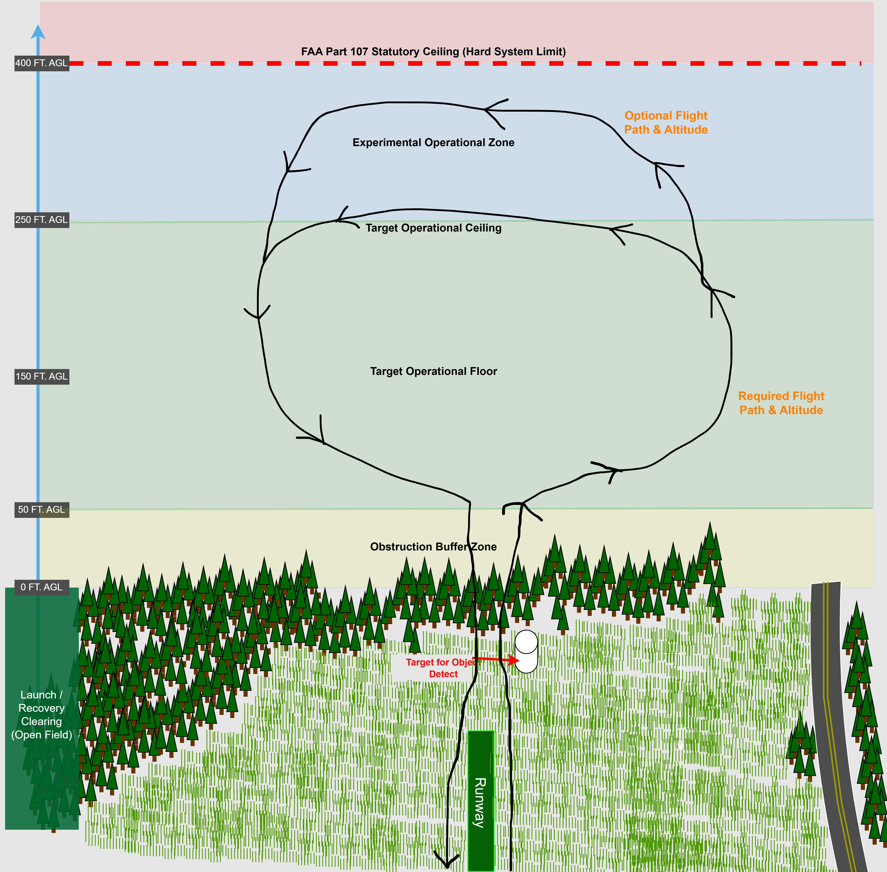
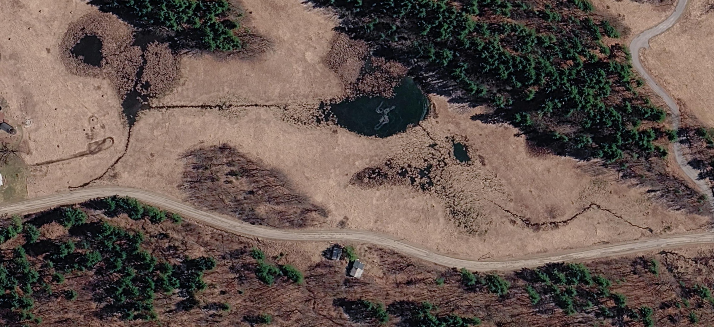
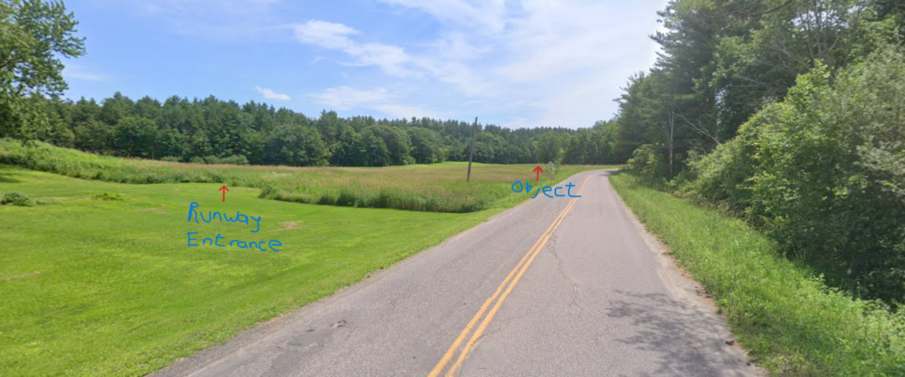

# Operational Environment & Regulatory Framework

## 1. Regulatory Context & Compliance Matrix
The AirSplitter Unmanned Aircraft System (UAS) operates strictly under the legal boundaries defined by the Federal Aviation Administration (FAA). Because this asset performs autonomous object detection and custom payload routing development, it complies with the following explicit frameworks:

### 1.1 Primary Framework: FAA Part 107 (Commercial/Research)
*   **Operating Authority:** Conducted under FAA Advisory Circular (AC) 107-2A guidelines.
*   **Airspace Restriction:** Restricted entirely to **Class G (Uncontrolled) Airspace** up to the baseline structural ceiling. Operations within Class B, C, D, or E surface areas require explicit LAANC (Low Altitude Authorization and Notification Capability) digital clearance prior to battery initialization.
*   **Visual Line of Sight (VLOS):** Per 14 CFR § 107.31(a), the Remote Pilot in Command (RPIC) must maintain continuous, un-aided visual line of sight with the aircraft to monitor its flight path, altitude, and spot real-world traffic hazards. Per § 107.33, a Visual Observer (VO) is optional; a VO may be deployed as a strategic tool to maintain asset awareness if the RPIC briefly diverts attention to the Ground Control Station screen, but a VO does not clear the RPIC of structural VLOS compliance. 

### 1.2 Registration & Identification
*   **FAA Digital Registration:** The airframe must display its unique FAA registration number externally via permanent marker or engraving.
*   **Remote ID (RID) Compliance:** Because the takeoff weight exceeds 250 grams (0.55 lbs), the aircraft must transmit active Remote ID telemetry broadcast signals via the onboard Holybro DroneCan Remote ID module mapped to the avionics suite.

---

## 2. Preliminary Environmental Operating Envelope & System Boundaries

### 2.1 Altitude Limits
Maximum **400 feet AGL (Above Ground Level)** per FAA § 107.51, with local operational flight testing targets set to a conservative 150–250 feet AGL to maximize the Sony IMX415 Image Sensor downward pixel density for object detection. Operations over unprotected human assemblies or moving vehicles are strictly prohibited under § 107.39 boundaries.

### 2.2 Range Specification and Binding System Constraint Analysis
The horizontal operating radius of the AirSplitter project is capped at an absolute threshold of **0.75 miles (1.2 km)** from the ground pilot station. While multiple subsystems impact range, this limit is governed strictly by human biology rather than electronic radio failure:

*   **2.4GHz ExpressLRS Control Uplink:** Up to 5.0+ Miles (8.0+ km) link availability.
*   **5.8GHz OpenIPC Video Downlink:** Up to 1.5 - 2.0 Miles (2.4 - 3.2 km) link availability via ground patch antenna tracking.
*   **BINDING LIMIT: Human Visual VLOS Threshold:** 0.75 Miles (1.2 km) operational cutoff.

1.  **Governing Boundary (Human Visual Acuity):** Human visual line-of-sight tracking for a 3-foot wingspan foam airframe degrades completely at a 0.75-mile (1.2 km) radius. Atmospheric haze or low contrast will truncate this flight boundary further. 
2.  **Uplink Link Margin (2.4GHz ExpressLRS):** Operating with a 250mW packet profile, the RadioMaster RP3 receiver maintains a safe Link Margin up to 5.0+ miles (8.0+ km), meaning the control link is never a limiting factor.
3.  **Downlink Link Margin (5.8GHz OpenIPC):** Utilizing the RunCam WiFiLink2-G VTX broadcasting through high-gain directional ground patch antennas, the video data network can close its link up to 1.5 to 2.0 miles (2.4 to 3.2 km). 

*Conclusion:* The 0.75-mile (1.2 km) boundary is a **Regulatory and Visual restriction** under 14 CFR § 107.31, leaving both the control and video communication arrays with massive safety link margins during open-field sorties.

---

## 3. Physical, Geographic, and RF Environment Constraints

### 3.1 Physical Environment & Material Boundaries (Paper-Backed Foam Board)
Because the airframe is fabricated from paper-backed polystyrene foam board, structural integrity is directly bound to immediate atmospheric conditions:
*   **Temperature Range:** **40°F to 90°F (4.4°C to 32.2°C).** Temperatures below 40°F cause the hot-glue joints and plastic control horns to become brittle and crack under stress. Temperatures exceeding 90°F cause localized skin warping and weaken internal adhesive bonds, risking structural failure under high-G maneuvers.
*   **Humidity Limitation:** **Maximum 75% Non-Condensing.** High relative humidity softens the paper-skin layer of the foam board. This completely destroys the tension-bearing skin strength, leading to wing warping or catastrophic mid-air main-wing structural failure.
*   **Precipitation Limit:** **0.0 mm/hr (Strict Zero-Tolerance).** Flight operations during active rain, drizzle, or heavy morning fog are prohibited. Moisture delaminates the paper backing from the foam core instantly and will flood the internal fuselage, causing immediate shorts on the uninsulated Raspberry Pi and Mateksys circuitry.

### 3.2 Geographic Operational Site Boundaries
Testing will be restricted to a designated **unpopulated rural open field / private test range** matching the following site-specific profile:
*   **Takeoff/Landing Surface:** Low-cut grass or smooth dirt clearing. Due to the lack of rigid landing gear on a lightweight 3 lb pusher airplane, the airframe will be hand-launched and belly-landed. 
*   **Obstruction Clearance:** Ground track boundaries must maintain a minimum 150-foot lateral buffer away from residential power lines, tall silos, and dense wooded treelines. Belly-landings must be executed in clearings free of rocks and thick brush to prevent tearing the fragile underbelly foam skin.

### 3.3 Radio Frequency (RF) Environment & Interference Matrix
The system utilizes a dual-link radio topology (2.4GHz for control link, 5.8GHz for OpenIPC video data stream). The operating site RF characteristics are defined below:
*   **Interference Mitigation:** 
    *   *Co-site Interference:* The 2.4GHz RC control receiver antennas must be physically separated from the 5.8GHz OpenIPC transmitter antennas inside the fuselage by at least 8 inches to prevent the high-power video signal from drowning out (RF desensing) the control link.
    *   *Environmental Interference:* Testing sites must be chosen away from industrial 2.4GHz/5.8GHz commercial Wi-Fi routers, high-voltage overland power lines, and cellular repeating towers to maintain a clean RF noise floor.

---

## 4. LiPo Battery Thermodynamic Operating Limits & Endurance Planning

### 4.1 Temperature-Induced Performance Deltas
The AirSplitter propulsion and edge-computing arrays are powered by a central Lithium-Polymer (LiPo) battery pack. Chemical discharge efficiency is bound to the following temperature-dependent operational envelopes:
*   **Optimal Range [60°F to 90°F / 15.5°C to 32.2°C]:** Baseline flight performance. Internal resistance is minimized, allowing consistent nominal current delivery to the Cobra 60A ESC. Expected flight endurance: **~15–20 minutes** at full cruise throttle and onboard compute power draw.
*   **Cold Weather Degradation Threshold [<50°F / 10°C]:** Severe drop in ion mobility spikes internal resistance. Attempting launch bursts triggers instantaneous voltage sag. *Endurance Safety Factor:* Flight planning timelines must automatically be truncated by **30% to 40%** (~8–12 minute flight ceilings maximum) to prevent unannounced cell exhaustion. 
*   **Thermal Safety Limit [>110°F / 43.3°C]:** High ambient temperatures combined with high-current internal discharge heat risk triggering structural swelling ("puffing") and internal layer short-circuits. Operations must be suspended to prevent catastrophic thermal runaway over wooded zones.

### 4.2 Pre-Flight Mitigations
For ambient operations below 55°F, batteries must be stored inside insulated, heated transport containers prior to airframe insertion. Launching with a cold-soaked battery pack is a strict flight safety violation.

---
## Operational Environment Diagram

## Aerial View of Operational Envrionment

## Front View of Operational Environment

