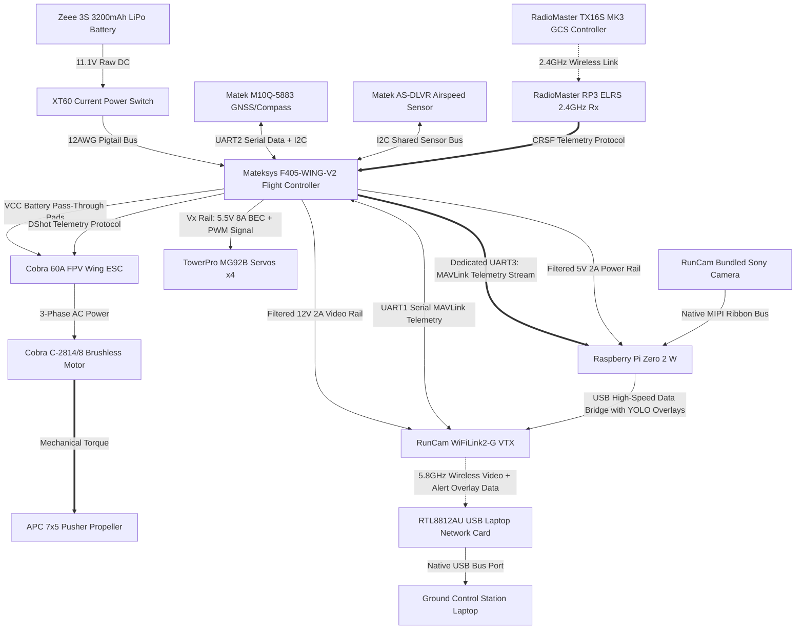

# System Subsystem Decomposition Matrix

The AirSplitter Unmanned Aircraft System (UAS) is broken down into seven distinct functional subsystems, mapping physical hardware nodes to explicit technical domains:

## 1. Subsystem Breakdown Structure (SBS)

### 1.1 Propulsion Subsystem
*   **Primary Hardware Components:** Cobra C-2814/8 Brushless Motor (1850Kv), APC 7x5 Thin Electric Pusher Propeller.
*   **Functional Objective:** Converts electrical energy into aerodynamic thrust, maintaining airspeed limits above the 14-knot stall threshold.

### 1.2 Power Subsystem
*   **Primary Hardware Components:** Zeee 3S 11.1V 3200mAh 50C LiPo Battery, Current On-Off Electric Power Switch (XT60), XT60 12AWG Pigtail Adapter Cable.
*   **Functional Objective:** Manages raw current distribution, isolates high-draw motor spikes, and provides filtered, continuous step-down voltage rails to critical computing blocks.

### 1.3 Avionics & Flight Control Subsystem
*   **Primary Hardware Components:** Mateksys F405-WING-V2 Flight Controller (FC), Matek M10Q-5883 GNSS & Compass Module, and  Matek Digital Airspeed Sensor AS-DLVR-I2C
*   **Functional Objective:** Computes real-time inertial navigation, tracks spatial coordinates/altitude via GPS, executes automated stabilization loops, computes airspeed for stabilization, and injects MAVLink telemetry data streams into the video path.

### 1.4 RF & Communications Subsystem
*   **Primary Hardware Components:** RadioMaster RP3 ELRS 2.4GHz Nano Receiver, RadioMaster TX16S MK3 Radio Controller (Ground Station Transmitter).
*   **Functional Objective:** Establishes a highly secure, non-interfering 2.4GHz uplink for long-range pilot control commands and semi-autonomous flight mode updates.

### 1.5 Edge Computing & Video Subsystem
*   **Primary Hardware Components:** Raspberry Pi Zero 2 W Companion Computer, RunCam WiFiLink2-G VTX (with bundled Sony Camera and RTL8812AU-based USB Laptop Network Card).
*   **Functional Objective:** Captures real-time environment data, runs local Python/OpenCV computer vision object-detection scripts, and broadcasts low-latency 5.8GHz video frames down to the GCS Laptop.

### 1.6 Actuation Subsystem
*   **Primary Hardware Components:** TowerPro MG92B High-Torque Metal Gear Servos (4), 3-pin Servo Extension Cables.
*   **Functional Objective:** Deflects the control surfaces (Ailerons, Elevator, Rudder) to translate autopilot electronic stabilization commands into mechanical aircraft attitude adjustments.

### 1.7 Structures Subsystem
*   **Primary Hardware Components:** White Paper-Backed Foam Board (20" x 30"), Adhesives (Hot glue/epoxy), Heat shrink, Soldering connections.
*   **Functional Objective:** Forms the aerodynamic lift-generating geometries (airfoils) and provides the physical chassis (fuselage) protecting internal electrical components from high-G flight strains.

---

