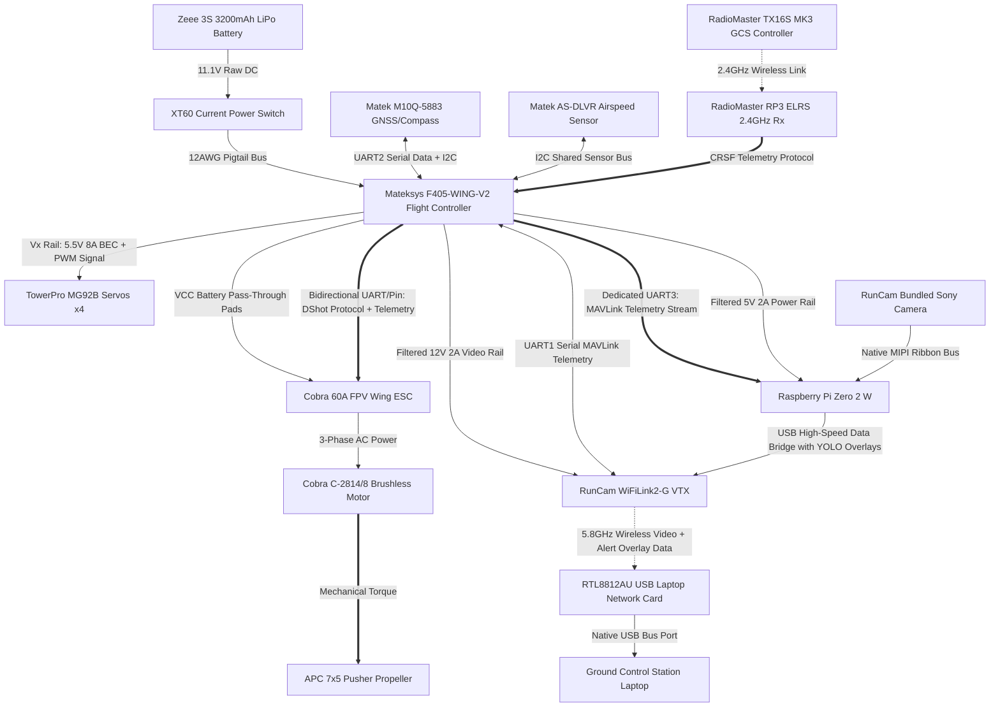

# System Subsystem Decomposition Matrix

The AirSplitter Unmanned Aircraft System (UAS) is broken down into seven distinct functional subsystems, mapping physical hardware nodes to explicit technical domains:

## System Architecture and System Boundaries

### 1. System Boundary Statement
The AirSplitter Project is architecturally bifurcated into two distinct segments, establishing a strict physical and wireless system boundary:

1. **Airborne Segment (The Aircraft):** Consists of all subsystems physically located on the airframe. This includes Propulsion, Power, Avionics/FC, Actuation, Structures, the airborne node of RF Communications (RP3 Rx), and the airborne node of Edge Computing (Pi Zero 2 W and RunCam VTX unit).
2. **Ground Segment (Ground Control Station):** Consists of all infrastructure located on the ground. This includes the RadioMaster TX16S MK3 Radio Controller, the RTL8812AU USB Laptop Network Card, and the GCS Laptop.

#### 1.1 Correction of Subsystem Scoping
* **Subsystem 1.5 (Edge Computing & Video):** Scopped *strictly* to the airborne components (Raspberry Pi Zero 2 W and the RunCam VTX module). 
* **Subsystem 1.8 (Ground Control Station):** A newly established 8th subsystem to house the GCS Laptop, the RTL8812AU Network Card, and the TX16S Radio Controller, ensuring the laptop is no longer orphaned.

## 1. Subsystem Breakdown Structure (SBS)

### 1.1 Propulsion Subsystem
*   **Primary Hardware Components:** Cobra C-2814/8 Brushless Motor (1850Kv), APC 7x5 Thin Electric Pusher Propeller.
*   **Functional Objective:** Converts electrical energy into aerodynamic thrust, maintaining airspeed limits above the 14-knot stall threshold.

### 1.2 Power Subsystem
*   **Primary Hardware Components:** Zeee 3S 11.1V 3200mAh 50C LiPo Battery, Current On-Off Electric Power Switch (XT60), XT60 12AWG Pigtail Adapter Cable.
*   **Functional Objective:** Manages raw current distribution, isolates high-draw motor spikes, and provides filtered, continuous step-down voltage rails to critical computing blocks.

### 1.3 Avionics & Flight Control Subsystem
*   **Primary Hardware Components:** Mateksys F405-WING-V2 Flight Controller (FC), Matek M10Q-5883 GNSS & Compass Module, and  Matek Digital Airspeed Sensor AS-DLVR-I2C
*   **Functional Objective:** Computes real-time inertial navigation, tracks spatial coordinates/altitude via GPS, executes automated stabilization loops, computes airspeed for stabilization, and injects MAVLink telemetry data streams into the video path.

### 1.4 RF & Communications Subsystem
*   **Primary Hardware Components:** RadioMaster RP3 ELRS 2.4GHz Nano Receiver, RadioMaster TX16S MK3 Radio Controller (Ground Station Transmitter).
*   **Functional Objective:** Establishes a highly secure, non-interfering 2.4GHz uplink for long-range pilot control commands and semi-autonomous flight mode updates.

### 1.5 Edge Computing & Video Subsystem
*   **Primary Hardware Components:** Raspberry Pi Zero 2 W Companion Computer, RunCam WiFiLink2-G VTX (with bundled Sony Camera and RTL8812AU-based USB Laptop Network Card).
*   **Functional Objective:** Captures real-time environment data, runs local Python/OpenCV computer vision object-detection scripts, and broadcasts low-latency 5.8GHz video frames down to the GCS Laptop.

### 1.6 Actuation Subsystem
*   **Primary Hardware Components:** TowerPro MG92B High-Torque Metal Gear Servos (4), 3-pin Servo Extension Cables.
*   **Functional Objective:** Deflects the control surfaces (Ailerons, Elevator, Rudder) to translate autopilot electronic stabilization commands into mechanical aircraft attitude adjustments.

### 1.7 Structures Subsystem
*   **Primary Hardware Components:** White Paper-Backed Foam Board (20" x 30"), Adhesives (Hot glue/epoxy), Heat shrink, Soldering connections.
*   **Functional Objective:** Forms the aerodynamic lift-generating geometries (airfoils) and provides the physical chassis (fuselage) protecting internal electrical components from high-G flight strains.

---

# Systems Architecture: Interface N2 Matrix & Data Routing

## 1. Structural N2 Interface Matrix

The matrix below maps structural outputs horizontally (rows) and inputs vertically (columns). Diagonal intersections contain the baseline subsystem hardware nodes. Empty cells represent zero direct structural interface.

| Rows (Outputs) \ Columns (Inputs) | 1. Power Bus | 2. Propulsion | 3. Avionics / FC | 4. Actuation | 5. RF Uplink (Rx) | 6. Edge Compute (Air) | 8. Ground Station (GCS) |
| :--- | :--- | :--- | :--- | :--- | :--- | :--- | :--- |
| **1. Power Bus (LiPo / Switch)** | **[POWER]** | | VCC Power Pass | 8A Vx Servo BEC | | 5V 2A Rail | |
| **2. Propulsion (ESC/Motor/Prop)**| | **[PROPULSION]**| ESC DShot Telem | Mechanical Load | | | |
| **3. Avionics / FC (Matek/GNSS)** | | DShot Control | **[AVIONICS]** | PWM Signals | CRSF Telemetry | UART3 MAVLink | |
| **4. Actuation (Servos)**          | | | | **[ACTUATION]** | | | |
| **5. RF Uplink (RP3 Rx Node)**    | | | CRSF Packets | | **[RF UPLINK]** | | |
| **6. Edge Compute (Pi/VTX Node)**  | | | | | | **[EDGE COMPUTE]**| 5.8GHz WFB-ng Stream |
| **8. Ground Station (GCS Segment)**| | | | | USB RC Control | | **[GROUND STATION]**|

---

## 2. Comprehensive Interface Data & Power Tables

Every intersection point on the matrix corresponds to a physical port pinout, wiring bus connection, or physical link on the aircraft.

### 2.1 Power Subsystem Interfaces
*   **Interface ID-01 (Battery to Power Switch):** Deans T-Connector to XT60 Adapter $\rightarrow$ Carries 11.1V raw DC current up to 60A surge.
*   **Interface ID-02 (Power Switch to Matek FC):** 12AWG Ultra-Flexible Silicone Wire Pigtail $\rightarrow$ Passes total system current to main distribution node.
*   **Interface ID-03 (FC to Cobra ESC Pass-Through):** VCC Battery Pass-Through Pads $\rightarrow$ Routes un-regulated LiPo voltage directly to the speed controller.

### 2.2 Propulsion & Drivetrain Interfaces (Missing Links Restored)
*   **Interface ID-04 (Cobra ESC to Cobra Motor):** 3-Phase AC Power Output Bullet Connectors $\rightarrow$ Delivers timed, high-current AC voltage to drive the brushless stator fields.
*   **Interface ID-05 (Cobra Motor to APC Propeller):** Direct Mechanical Collet Prop Adapter $\rightarrow$ Transfers rotative kinetic shaft torque directly to the 7x5 pusher blade.
*   **Interface ID-06 (Cobra ESC to Matek FC):** Telemetry Pad Wire $\rightarrow$ Feeds real-world ESC internal temperature, voltage, and motor RPM back to the flight logs via the DShot protocol.

### 2.3 Flight Controller (FC) Data & Voltage Rails
*   **Interface ID-07 (FC to Raspberry Pi Zero 2 W):** 5V Pad & GND Pad $\rightarrow$ Delivers a continuous, filtered 5V (2A maximum) rail to protect the Pi processor from motor induction brownouts.
*   **Interface ID-08 (FC to RunCam VTX):** 9V/12V Switchable BEC Pad $\rightarrow$ Delivers high-current filtered power isolated from the main logic bus.
*   **Interface ID-09 (FC to RunCam VTX Data Bus):** UART1 (TX1/RX1) $\rightarrow$ Transmits continuous bidirectional MAVLink packets to inject On-Screen Display (OSD) parameters onto the live video frame.
*   **Interface ID-10 (FC to Raspberry Pi Zero 2 W Data Bus):** UART3 (TX3/RX3) $\rightarrow$ Pipes continuous MAVLink high-speed telemetry strings straight to the Pi for real-time computer vision geotagging and coordinate logging.
*   **Interface ID-11 (FC to Matek M10Q GNSS):** I2C Bus (SCL/SDA) + UART2 (TX2/RX2) $\rightarrow$ Inputs compass magnetics data and raw GPS NMEA string coordinate streams at 10Hz updates.
*   **Interface ID-12 (FC to Matek Airspeed Sensor):** Shared I2C Bus $\rightarrow$ Ingests differential pressure metrics from the AS-DLVR digital sensor node.

### 2.4 Radio Frequency Control & Uplink Links (Missing Link Restored)
*   **Interface ID-13 (RadioMaster RP3 Rx to Matek FC):** 4-Pin Serial Lead Array $\rightarrow$ Feeds high-speed bidirectional control parameters and flight link statistics via the **CRSF (Crossfire) protocol**.
*   **Interface ID-14 (GCS Laptop to TX16S Radio Transmitter):** USB-C Data Cable $\rightarrow$ Maps ground control station waypoints and flight configuration command overwrites to the uplink module.

### 2.5 Edge Computing & RF Video Downlink
*   **Interface ID-15 (RunCam Camera to RunCam VTX Internal):** Proprietary digital ribbon cable $\rightarrow$ Streams raw uncompressed HD frames to the internal processing board.
*   **Interface ID-16 (RunCam VTX to Pi Zero 2 W):** Micro-USB to 4-pin Data Bridge Cable $\rightarrow$ Creates an airborne local IP network connection over an internal hardware data bus to route processing streams into local Python OpenCV pipelines.
*   **Interface ID-17 (RunCam VTX to Ground Network Card):** 5.8GHz Wireless Radio Frequency $\rightarrow$ Broadcasts high-power WFB-ng optimized network packets over the air up to the 0.75-mile open field test range limit.
*   **Interface ID-18 (RTL8812AU Network Card to GCS Laptop):** Native USB-A / USB-C Port $\rightarrow$ Passes incoming digital streaming frames straight into laptop memory as a standard UVC webcam instance (`/dev/video0`).
