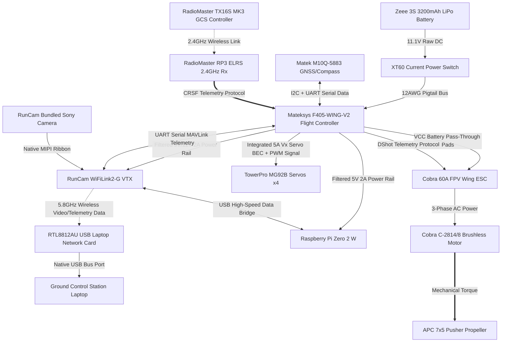

# System Subsystem Decomposition Matrix

The AirSplitter Unmanned Aircraft System (UAS) is broken down into seven distinct functional subsystems, mapping physical hardware nodes to explicit technical domains:

## 1. Subsystem Breakdown Structure (SBS)

### 1.1 Propulsion Subsystem
*   **Primary Hardware Components:** Cobra C-2814/8 Brushless Motor (1850Kv), APC 7x5 Thin Electric Pusher Propeller.
*   **Functional Objective:** Converts electrical energy into aerodynamic thrust, maintaining airspeed limits above the 14-knot stall threshold.

### 1.2 Power Subsystem
*   **Primary Hardware Components:** Zeee 3S 11.1V 3200mAh 50C LiPo Battery, Current On-Off Electric Power Switch (XT60), XT60 12AWG Pigtail Adapter Cable.
*   **Functional Objective:** Manages raw current distribution, isolates high-draw motor spikes, and provides filtered, continuous step-down voltage rails to critical computing blocks.

### 1.3 Avionics & Flight Control Subsystem
*   **Primary Hardware Components:** Mateksys F405-WING-V2 Flight Controller (FC), Matek M10Q-5883 GNSS & Compass Module.
*   **Functional Objective:** Computes real-time inertial navigation, tracks spatial coordinates/altitude via GPS, executes automated stabilization loops, and injects MAVLink telemetry data streams into the video path.

### 1.4 RF & Communications Subsystem
*   **Primary Hardware Components:** RadioMaster RP3 ELRS 2.4GHz Nano Receiver, RadioMaster TX16S MK3 Radio Controller (Ground Station Transmitter).
*   **Functional Objective:** Establishes a highly secure, non-interfering 2.4GHz uplink for long-range pilot control commands and semi-autonomous flight mode updates.

### 1.5 Edge Computing & Video Subsystem
*   **Primary Hardware Components:** Raspberry Pi Zero 2 W Companion Computer, RunCam WiFiLink2-G VTX (with bundled Sony Camera and RTL8812AU-based USB Laptop Network Card).
*   **Functional Objective:** Captures real-time environment data, runs local Python/OpenCV computer vision object-detection scripts, and broadcasts low-latency 5.8GHz video frames down to the GCS Laptop.

### 1.6 Actuation Subsystem
*   **Primary Hardware Components:** TowerPro MG92B High-Torque Metal Gear Servos (4), 3-pin Servo Extension Cables.
*   **Functional Objective:** Deflects the control surfaces (Ailerons, Elevator, Rudder) to translate autopilot electronic stabilization commands into mechanical aircraft attitude adjustments.

### 1.7 Structures Subsystem
*   **Primary Hardware Components:** White Paper-Backed Foam Board (20" x 30"), Adhesives (Hot glue/epoxy), Heat shrink, Soldering connections.
*   **Functional Objective:** Forms the aerodynamic lift-generating geometries (airfoils) and provides the physical chassis (fuselage) protecting internal electrical components from high-G flight strains.

---

## 2. Power Architecture Routing and Trace Map
Power flows from your chemical storage block through a series of hardware voltage-step-down transitions managed by the flight controller to deliver isolated, clean current loops to your electronics:

                  +-----------------------------------+

                  | Zeee 3S 3200mAh LiPo Battery Pack |
                  +-----------------+-----------------+
                                    |
                                    v [11.1V Nominal DC]
                  +-----------------+-----------------+

                  | XT60 Mechanical Current On/Off SW |
                  +-----------------+-----------------+
                                    |
                                    v [11.1V Main Bus Line]
                  +-----------------+-----------------+

                  | Mateksys F405-WING-V2 Flight Controller Hub |
                  +--------+-----------+-----------+--------+

                           |           |           |
     [Pass-Through VCC]    |           |           | [Internal 5V 2A Regulator]
                           v           |           v
+----------------------------+         |     +-------------------------+

| Cobra 60A ESC & Motor      |         |     | Raspberry Pi Zero 2 W   |
+----------------------------+         |     | RadioMaster RP3 ELRS Rx |
                                       |     +-------------------------+
            [Internal Vx 8A BEC Rail]  v
         +-------------------------------+

         | TowerPro MG92B Servos (x4)    |
         +-------------------------------+

## 3. Comprehensive System Power Budget Table

The matrix below quantifies your electrical boundaries at a nominal voltage of 11.1V (3S LiPo architecture). These values account for full-load execution loops—such as the Raspberry Pi running localized, multi-threaded CNN inferences alongside maximum simultaneous servo flight-surface corrections.

| Component / Subsystem Node | Operating Voltage (V) | Estimated Current (Idle) | Estimated Current (Peak) | Power Consumption (Max) | Engineering Margin / Rail Compliance |
| :--- | :--- | :--- | :--- | :--- | :--- |
| **Cobra C-2814/8 Brushless Motor** | 11.1V (Direct) | 1.20 A | 45.00 A | 499.50 W | Supplied via VCC Pass-Through Pads. |
| **Mateksys F405-WING-V2 Logic** | 5.0V (Internal) | 0.15 A | 0.25 A | 1.25 W | Internal step-down logic bus. |
| **Raspberry Pi Zero 2 W Payload** | 5.0V (Regulated) | 0.20 A | 0.70 A | 3.50 W | Max CPU loading on FC 5V/2A rail. |
| **TowerPro MG92B Servos (x4 Total)**| 5.0V (Regulated) | 0.04 A | 3.20 A | 16.00 W | Driven entirely by the FC Vx 8A BEC rail. |
| **RadioMaster RP3 ELRS Receiver** | 5.0V (Regulated) | 0.05 A | 0.10 A | 0.50 W | Powered via the FC 5V/2A rail. |
| **RunCam WiFiLink2-G VTX Module** | 11.1V (Regulated) | 0.45 A | 0.72 A | 8.00 W | Powered via the FC 9V/12V 2A rail. |
| **Matek M10Q-5883 GNSS / Compass**| 5.0V (Regulated) | 0.05 A | 0.08 A | 0.40 W | Powered via the FC 5V/2A rail. |
| **TOTAL SYSTEM CONSUMPTION** | **—** | **2.14 A** | **50.15 A** | **529.15 W** | **Headroom satisfies current loads.** |

### 3.1 Flight Controller Internal Rail Verification:
*   **Total 5V/2A Regulator Load (Pi + Rx + GPS):** Peak draw is **0.88 Amps**. This fits within the Mateksys 5V **2.0 Amp current limit**, providing a safe **56% buffer**.
*   **Total Vx Servo Rail Load (4x Servos):** Peak draw is **3.20 Amps**. This fits within the Mateksys Vx **8.0 Amp continuous current limit**, providing an exceptional **60% structural buffer**.
*   **Total Vtt Video Rail Load (RunCam VTX):** Peak draw is **0.72 Amps**. This fits within the Mateksys 9V/12V **2.0 Amp current limit**, providing a **64% buffer**.

