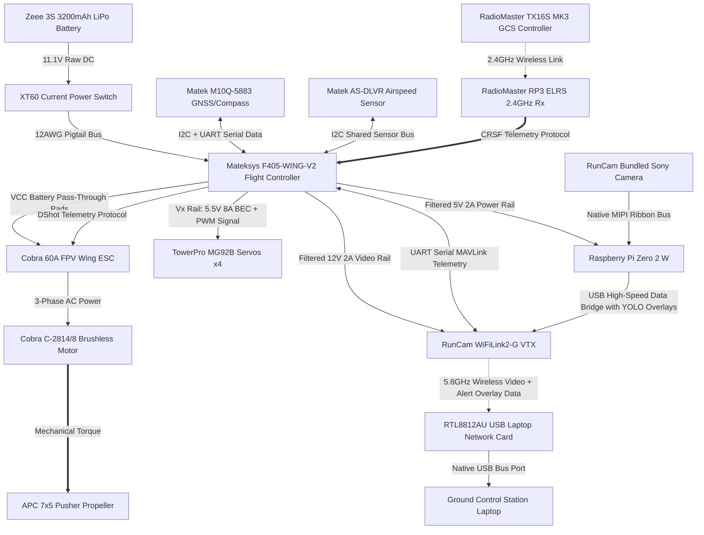

# Subsystem Mapping & Bill of Materials (BOM)

This document establishes the hardware inventory, subsystem boundaries, and electrical/data interfaces for the AirSplitter autonomous fixed-wing aircraft.

## 1. Complete System Bill of Materials (BOM)

| Subsystem | Component Description | Qty | Key Specifications |
| :--- | :--- | :--- | :--- |
| **Airframe** | White Foam Board (20” x 30”) | — | Hand-cut airfoils, fuselage, elevator, and rudder |
| **Propulsion** | Cobra C-2814/8 Brushless Motor | 1 | Kv=1850, high-torque outrunner |
| **Propulsion** | APC 7x5 Thin Electric Pusher Propeller | 1 | Configured for rear pusher orientation |
| **Power/ESC** | Cobra 60A FPV Wing ESC | 1 | 6A Switching BEC (Bypassed for Servos) |
| **Power/ESC** | Zeee 3S LiPo Battery | 1 | 3200mAh, 11.1V, 50C Discharge, Soft Case |
| **Power/ESC** | Current On-Off Electric Power Switch | 1 | High-current mechanical switch with XT60 handles |
| **Power/ESC** | XT60 Adapter with Pigtail Bus | 1 | 12AWG 100mm Ultra‑Flexible Silicone Wire |
| **Avionics** | Mateksys Flight Controller F405-WING-V2 | 1 | STM32F405 MCU, ICM42688-P IMU, DPS310 Baro |
| **Avionics** | Matek M10Q-5883 GNSS & Compass | 1 | u-blox M10 engine, QMC5883L Magnetometer via I2C |
| **Avionics** | Matek Digital Airspeed Sensor AS-DLVR-I2C | 1 | DLVR-L10D, I2C interface, AS-DLVR-I2C with CAN Node L431 |
| **Actuators** | TowerPro MG92B Servos | 4 | Digital, Metal Gear, High Torque |
| **Actuators** | 3-pin Servo Extension Wire Cables | — | Signal and power distribution extension lines |
| **Uplink** | RadioMaster RP3 ELRS FPV Receiver | 1 | 2.4GHz ExpressLRS Nano Receiver, Dual Antenna |
| **Edge Compute** | Raspberry Pi Zero 2 W | 1 | Quad-core 64-bit ARM Cortex-A53, Local CV Node |
| **Downlink** | RunCam WiFiLink2-G VTX & Sony Camera | 1 | Integrated Sony IMX415 Sensor & 5.8GHz OpenIPC VTX |
| **Ground Station**| RadioMaster TX16S MK3 Radio Controller | 1 | 2.4GHz ELRS Mode 2 Transmitter |
| **Ground Station**| Laptop Computer (GCS) | 1 | Control Central, video streaming, cloud uplink |
| **Ground Station**| RTL8812AU USB Laptop Network Card | 1 | 5.8GHz High-Power USB Wi-Fi Receiver Card |
| **Consumables** | Soldering wire, Heat shrink, Adhesives | — | Bench assembly and airframe laminating materials |

---

## 2. Integrated System Architecture Diagram

This diagram models the **True Edge Computing** pipeline. Video frames are captured by the Sony camera, processed on the Raspberry Pi Zero 2 W for target tracking overlays, and then passed to the RunCam OpenIPC VTX for transmission down to the ground network card.

---

## 3. Core Subsystem Operational Protocols

### Power Routing Mechanics
The **Mateksys F405-WING-V2** acts as the singular power distribution center. 
* **Servos:** Powered via the board's internal **Vx BEC**, jumped via solder pads to output exactly **6.0V** to maximize torque on the TowerPro MG92B digital servos. 
* **Edge Compute:** The Raspberry Pi Zero 2 W draws power from a dedicated **5V 2A rail**.
* **Video Downlink:** The RunCam WiFiLink2-G VTX is supplied directly via the filtered **9V/12V BEC** pad to insulate it from motor ripple noise.

### Data Pipelines
1. **Command Link (Uplink):** 2.4GHz ELRS wireless signals travel from the TX16S to the RP3 receiver, passing high-frequency CRSF packet streams to the flight controller.
2. **Telemetry & Navigation:** The Matek M10Q-5883 parses live coordinates over UART, and true heading over I2C lines to update autopilot vectors.
3. **Vision Processing (Downlink):** The Pi Zero captures video, overlays tracking data, and hands off the frames to the VTX via USB logic to be parsed as an OpenIPC UVC stream on the ground laptop.
