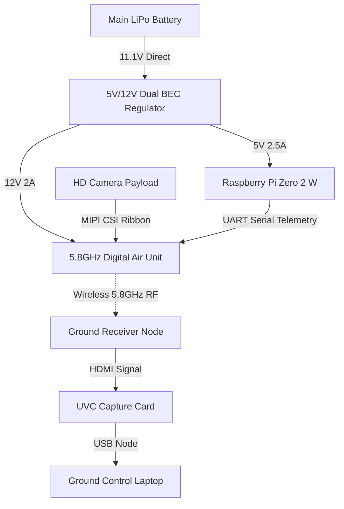

# 2.1 Component-to-Subsystem Mapping Matrix

This architectural control document explicitly allocates every physical Bill of Materials (BOM) item and structural component to its respective functional aircraft subsystem.

| Component / Airframe Part | Manufacturer / Model / Material | Allocated Subsystem | Primary Functional Role Within Subsystem |
| :--- | :--- | :--- | :--- |
| **Brushless Motor** | Cobra C-2814/8 (Kv=1850) | Propulsion (PROP) | Converts electrical energy into kinetic rotational energy. |
| **Propeller** | Optimized Flight Propeller | Propulsion (PROP) | Translates rotational torque into aerodynamic kinetic thrust. |
| **Electronic Speed Controller** | Cobra 60A FPV Wing ESC | Propulsion / Power | Modulates three-phase motor current; steps down voltage via 6A BEC. |
| **LiPo Battery** | Zeee 3S 3200mAh 11.1V 50C | Power Distribution (PWR) | Master chemical energy reservoir for the complete system bus. |
| **Power Switch & Wiring** | Current On-Off XT60 / 12AWG | Power Distribution (PWR) | Master physical circuit breaker and high-current power distribution lines. |
| **Flight Controller** | Mateksys F405-WING-V2 | Guidance, Nav, & Control (GNC) | Embedded autopilot core; runs IMU sensor loop configurations. |
| **GNSS & Compass Module** | Matek M10Q-5883 | Guidance, Nav, & Control (GNC) | Generates global 3D coordinate tracking and true magnetic heading. |
| **Radio Receiver** | RadioMaster RP3 ELRS 2.4GHz | Communication (COMMS) | Receives uplink pilot control pulses; transmits downlink telemetry back. |
| **Digital Servos** | TowerPro MG92B | Actuation (ACT) | Electronically drives the physical mechanical linkages to control surfaces. |
| **Ailerons** | White Foam Board | Actuation / Aerostructures | Deflects air asymmetrically to execute aerodynamic roll control. |
| **Elevator** | White Foam Board | Actuation / Aerostructures | Deflects air symmetrically to execute aerodynamic pitch control. |
| **Rudder** | White Foam Board | Actuation / Aerostructures | Deflects air vertically to execute aerodynamic yaw control. |
| **Wings** | White Foam Board / Primary Spar | Aerostructures (AERO) | Generates aerodynamic lift forces and provides lateral stabilization. |
| **Fuselage** | Balsa Wood | Aerostructures (AERO) | Central structural aerodynamic fairing; protects internal electronics payload. |
| **Wheels** | Landing Gear Assembly | Aerostructures (AERO) | Absorbs kinetic impact loading during takeoff and recovery sequences. |
| **Edge Companion Computer** | Raspberry Pi Zero 2 W | Mission Payload (PAYLOAD) | Executes local computer vision scripts and handles high-level sorting. |
| **Servo Wire Extensions** | 3-pin Servo Cables | Wiring Interconnect (BUS) | Conducts low-voltage PWM signals and 5V power to localized actuators. |

## 2.2. Primary Downlink Node (5.8GHz RF Architecture)
Following a trade study evaluating local environmental interference (wooded terrain) and computational overhead on the Raspberry Pi Zero 2 W, a dedicated digital 5.8GHz RF link has been selected.

graph TD
    %% Airborne Infrastructure
    subgraph Airborne Aircraft Node
        Cobra_ESC[Cobra 60A ESC] -->|Raw LiPo Power| Matek_FC[Mateksys F405-WING-V2]
        
        Matek_FC -->|Clean 5V Rail| Pi_Zero[Raspberry Pi Zero 2 W]
        Matek_FC -->|Isolated 9V/12V Rail| Walksnail_VTX[Walksnail Avatar VTX V2/V3]
        
        ArduCam[ArduCam 5MP Camera] -->|CSI Ribbon Cable| Pi_Zero
        Pi_Zero -->|Digital Output Cable| Walksnail_VTX
    end

    %% Wireless Transmission Bridge
    Walksnail_VTX -.->|Wireless 5.8GHz Radio Waves| Walksnail_VRX

    %% Ground Station Infrastructure
    subgraph Ground Control Station Node
        Walksnail_VRX[Walksnail Avatar FPV VRX Receiver] -->|HDMI Cable| UVC_Cap[USB Capture Card Dongle]
        UVC_Cap -->|USB Native Bus Port| GCS_Laptop[Ground Control Laptop]
    end

## 2. Component Budgetary Constraints
* **Pi Computational Load:** Independent ASIC video encoding on Air Unit ensures ~0% CPU strain on Pi Zero for video transmission.
* **Power Bus Impact:** Isolated from Pi power rail; eliminates brown-out risks.
